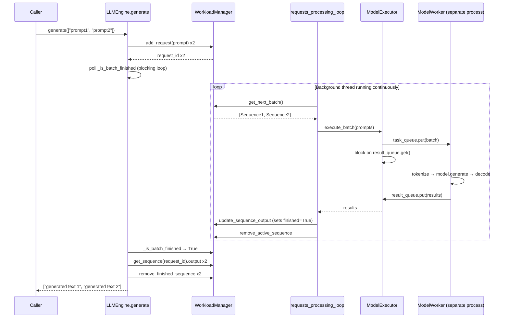

# Single Model Serving — Flow Notes

## System Overview

There are five components and each has a distinct responsibility:

| Component | Responsibility |
|---|---|
| `LLMEngine` | Top-level orchestrator. Entry point for callers. |
| `WorkloadManager` | Tracks all sequences (incoming, active, finished). Shared state. |
| `ModelExecutor` | Owns the worker process and the two queues. Sends batches, receives results. |
| `ModelWorker` | Runs inside a separate OS process. Loads the model. Does the actual inference. |
| `ModelManager` | Loads and returns the model and tokenizer from HuggingFace. |

---

## The Two Parallel Paths in LLMEngine

When `LLMEngine` is instantiated, two things start:

1. A **background thread** running `requests_processing_loop` — continuously drains the workload manager and sends batches to the worker.
2. The caller later calls `generate(prompts)` — this adds requests to the workload manager and waits for results.

These two paths communicate only through the `WorkloadManager`. They never call each other directly.

---

## Full Request Flow

### Step 1 — Caller invokes `generate`

```python
engine.generate(["What is AI?", "Who is Modi?"])
```

- For each prompt, `WorkloadManager.add_request()` creates a `Sequence` object with a UUID, puts it in `incoming_queue`, and registers it in `sequence_map`.
- `generate` notes all the request IDs and starts polling `_is_batch_finished`.

### Step 2 — Background thread picks up the batch

`requests_processing_loop` runs in a `while True` loop:

- Calls `WorkloadManager.get_next_batch()` — moves sequences from `incoming_queue` into `active_sequences` (up to `batch_size`) and returns them.
- If nothing is waiting, sleeps 0.5s and checks again.
- Formats the batch as `[{"prompt": ..., "id": ...}, ...]` and calls `ModelExecutor.execute_batch`.

### Step 3 — ModelExecutor sends to the worker process

`execute_batch` does two things:

1. Puts the batch into `task_queue` (an `mp.Queue` shared with the worker process).
2. Blocks on `result_queue.get()` — sits and waits until the worker puts results back.

This blocking call is the synchronisation point. The background thread cannot send another batch until this one is fully returned.

### Step 4 — ModelWorker processes the batch

`ModelWorker.run` is a `while True` loop inside a separate OS process:

- Calls `task_queue.get()` — blocks until a batch arrives.
- Calls `worker.generate(batch)` — tokenizes, runs `model.generate`, decodes, returns `[{"request_id": ..., "generated_text": ...}, ...]`.
- Puts the result into `result_queue`.
- Goes back to waiting.

### Step 5 — Results flow back

- `execute_batch` unblocks (its `result_queue.get()` returns).
- `requests_processing_loop` receives the results.
- For each result: calls `update_sequence_output` (appends text, sets `finished=True` on the `Sequence` object) and `remove_active_sequence` (removes from `active_sequences`).

### Step 6 — `generate` unblocks and returns

- `generate`'s polling loop calls `_is_batch_finished` which checks `sequence.finished` for each request ID.
- All are now `True`, so the loop exits.
- `generate` reads `.output` from each sequence via `get_sequence`, calls `remove_finished_sequence` to clean up `sequence_map`, and returns the list of generated texts.

---

## Why the WorkloadManager is Shared State

`WorkloadManager` holds `Sequence` objects. These are Python objects stored by reference, not copied. When `update_sequence_output` appends to `sequence.output` and sets `sequence.finished = True`, it mutates the same object in memory that `generate` later reads via `get_sequence`. No return value or message passing is needed between the two paths — they share the same object.

---

## Clarifications on the ModelExecutor

### Q: Are we creating a new process inside one of the threads to run the model?

Partially. The worker process is created in the **main thread** during `LLMEngine.__init__` → `setup_worker`. It is not created inside the background thread. The background thread only communicates with the already-running worker process via queues.

### Q: Once the model is loaded, are we sending requests by creating a separate thread for each?

No. There is exactly **one worker process** and it runs for the lifetime of the engine. The model is loaded once when the process starts. Requests are sent to it via `task_queue`. No new threads or processes are created per request.

### Q: Can we not send another request until the current one is finished?

Correct in effect. `execute_batch` blocks on `result_queue.get()` until the worker returns. So the background thread cannot send the next batch until the worker finishes the current one. But this is enforced by the blocking queue — not by manually managing thread lifecycles. The thread itself keeps running; it just sits blocked on `result_queue.get()`.

### Q: Does the system wait for a batch to finish before sending the next one?

Yes. The sequence is strictly: send batch → block → receive result → send next batch. While this means the worker is never handling two batches simultaneously, it also means multiple user requests that arrive during inference will accumulate in `incoming_queue` and be picked up together as the next batch — giving natural batching without any explicit coordination.

---

## Flow Diagram



---

## Key Design Decisions

**Why a separate process for the worker, not a thread?**
The model runs on GPU/MPS. Python's GIL would prevent true parallelism with threads. A separate process has its own memory space and GIL, so the model runs without interference from the main process.

**Why queues between executor and worker?**
`mp.Queue` is the standard safe way to pass data between processes — it handles serialisation and synchronisation automatically.

**Why a background thread in LLMEngine?**
So that `generate` (called by potentially many concurrent users) never directly touches the worker. The background thread is the single gatekeeper — it serialises all worker communication and batches waiting requests together.
